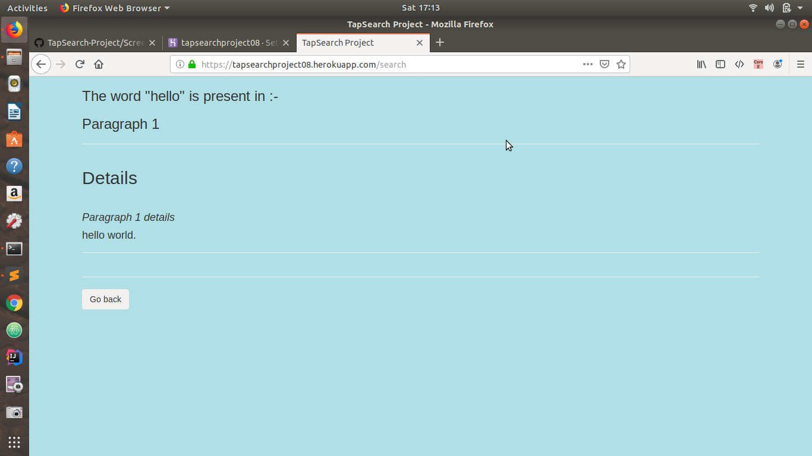
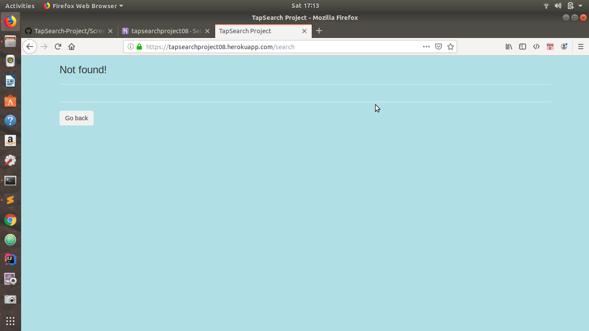

 # TapSearch-Project
 
> Link :- https://tapsearchproject08.herokuapp.com/

## To run this program your system should have following:
* Python version >= 3.5
* Flask
* Internet connectivity

## Step to run this app
* Clone this repository
* Run app.py file
* The web app will be running on the local server. 

# Input & Output 
 ```
Input 1 - If the word is present in the document.
Output 1-


Input 2 - If the word is not present in the document.
Output 2-

